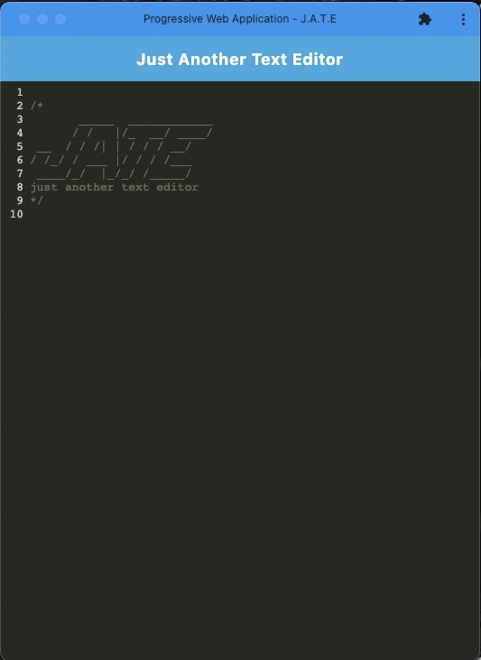

# Progressive Web Application Text Editor
 

## Description

I created a simple text editor that is also a PWA (Progressive Web Application). The application uses webpack plugins to generate a service worker and manifest file. It also uses IndexedDB to store and retrieve data while having several persistance techniques as redundancy. The application can function offline and can be downloaded to run as a PWA on your local computer. 

## Table of Contents (Optional)

- [Usage](#usage)
- [Credits](#credits)
- [License](#license)

## Usage
Follow this [link]() to visit the application deployed on Heroku. As you enter your notes, they will automatically be saved as the application loses focus. You can close the window and when you return your notes will persist unless you clear the storages. Click 'Install' to download the PWA as an icon to your local computer. You can launch the application using this without visiting the link.   

## Credits
- Express
- IndexedDB
- Babel
- Codemirror
- Webpack
- Workbox
- Starter code and resources provided by the UofU Coding Bootcamp

## License
This project is licensed under the MIT license.

## How to Contribute

Please visit the [Contributor Covenant](https://www.contributor-covenant.org/)

  ## Questions

  If you have any questions, please contact me at evermuniz@outlook.com.
  You can also visit my GitHub profile [here](https://github.com/evermuniz/)